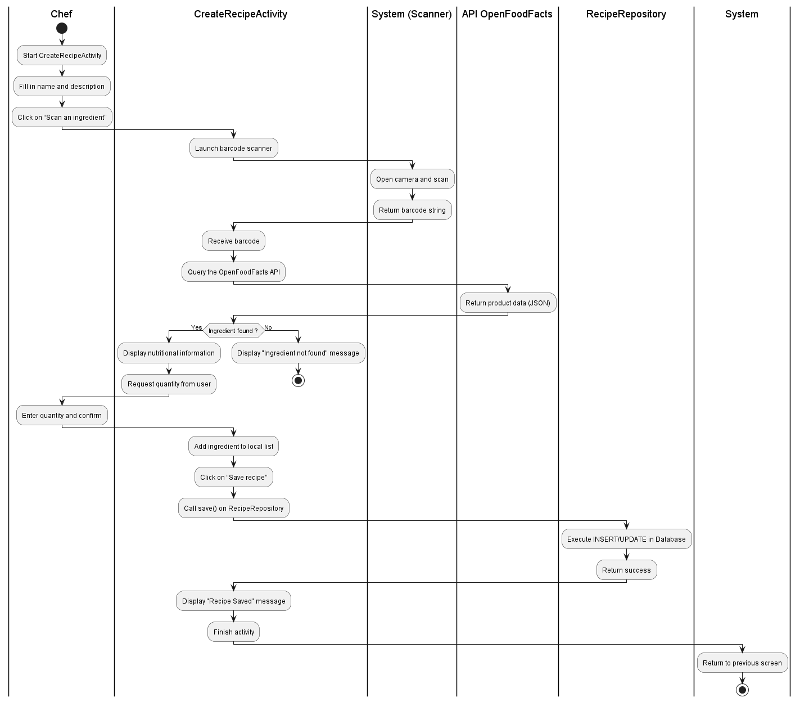
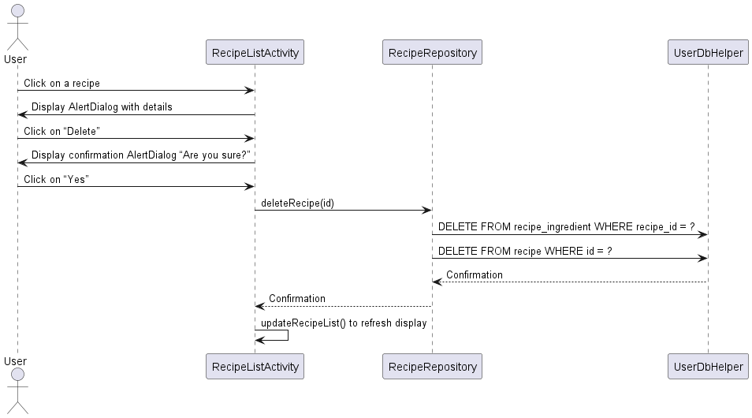
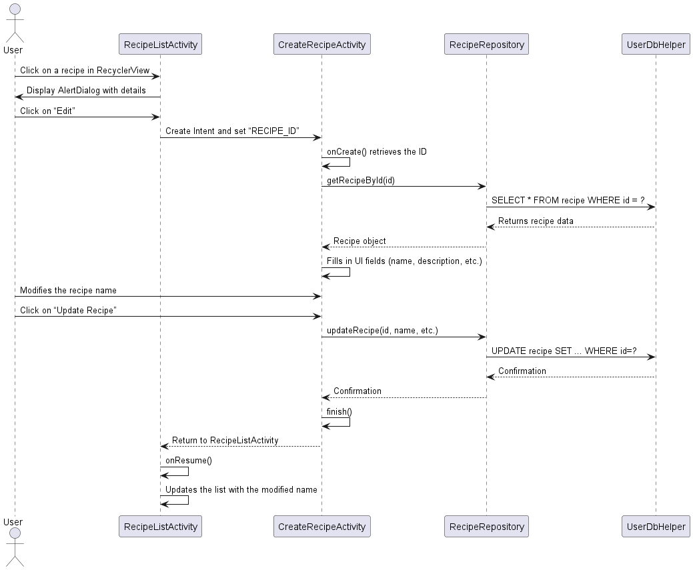
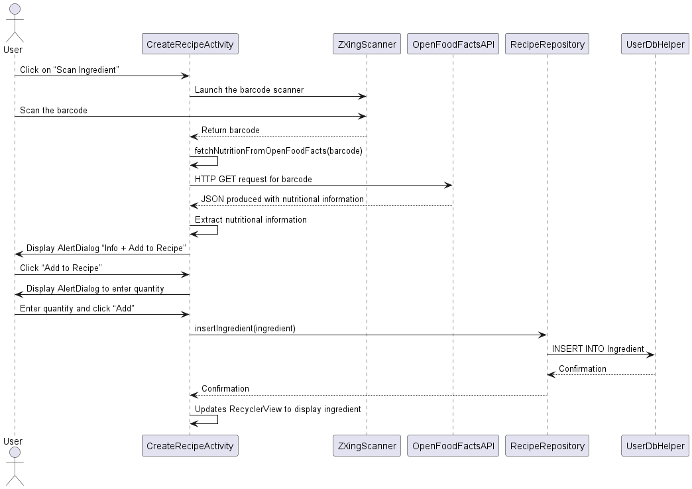

# Groupe-33-repo - Projet uTaste
Ceci est notre fichier README au format Markdown contenant des informations utiles dont :
- Une description de notre projet
- L’état courant du projet (fonctionnalité ajoutée)
- le processus de reconstruction
- Un scénario de validation de notre livrable
- Des limites éventuelles (anomalie, fonctionnalité manquante...)

## Modèles conceptuels
###  Diagramme de classes

Le fichier source PlantUML est disponible dans `doc/Class_diagramV4.puml`.

---
### Diagramme d'activité – Création de recette

Le fichier source PlantUML est disponible dans `doc/Activity_diagram_recipeCretation.puml`.

---
### Diagramme de séquence – Suppression de recette

Le fichier source PlantUML est disponible dans `doc\Les diagramme de sequence\Delete_Recipe.puml`.

---
### Diagramme de séquence – Modification de recette

Le fichier source PlantUML est disponible dans `doc\Les diagramme de sequence\ModifyRecipe.puml`.

---
### Diagramme de séquence – Ajout d’ingrédient & Récupération des nutriments

Le fichier source PlantUML est disponible dans `doc\Les diagramme de sequence\AddIngredient_&_FetchNutriment.puml`.


## Description de notre projet
uTaste est une application Android développée en Java avec Android Studio dans le cadre du cours SEG2505 – Conception et implémentation logicielle à l’Université d’Ottawa. L’objectif est de créer une solution logicielle complète pour la gestion d’un restaurant gastronomique, intégrant des rôles utilisateurs : administrateur, chef cuisinier et serveur.

## État courant du projet
Les fonctionnalités principales implémentées depuis le dernier livrable pour chaque rôle sont ;

**Hors rôle :**
- Le rapport final a été créé et se trouve dans le même dossier que ce readme

**Administrateur :**

Rien a changé depuis le dernier livrable
- Réinitialiser la base de données 
- supprimer les vendeurs
- supprimer les recettes
- supprimer les ingrédients
- Réinitialiser le mot de passe d’un autre utilisateur
- Réinitialiser son propre mot de passe
 
**Chef :**

Rien a changé depuis le dernier livrable
-  peut obtenir des informations nutritionnelles pertinentes sur chaque ingrédient
-  peut calculer le bilan calorique, en glucides, protides et lipides de la recette

**Serveur/Vendeur :**
- Un vendeur peut voir la liste des recettes et leur bilan calorique
- Un vendeur peut enregistrer une vente avec une note et une appréciation
- Un vendeur peut avoir un bilan des ventes contenant :
  - la liste des recettes vendues et le nombre de ventes pour chaque recette
  - la note moyenne de chaque recette
 
## Limites éventuelle
- Nécessite l'accès à l'internet
- Compatibilité peut être limité parce qu'on utilise Android (API ≥ 30) et pourrait rencontrer des problèmes sur d’autres versions.
- Il y a un seul administrateur et chef qui peut rendre à des limites logistiques (gestion de mot de passe limité)
- La base de donnée n'est pas synchronisée
- Les tests automatiques ne remplacent pas la validation manuelle

## Scénario de validation
1. Lancer l’application Android Studio sur un émulateur ou appareil physique (API 30+).  
2. Se connecter en tant que :
   - **Admin :** `admin@local` / `admin-pwd`
   - **Chef :** `chef@local` / `chef-pwd`
3. Tester les fonctionnalités accessibles selon le rôle :
   - Admin : voir les fonctionnalités au-dessus
   - Chef : voir les fonctionnalités au-dessus
      - Note pour l'ajout d'ingrédients lors de la création d'une recette: Va sur le site https://world.openfoodfacts.org/, recherche n'importe quel ingrédient et scan le code bar avec ton téléphone (disponible en cliquant sur "Add Ingredient" lors de la création d'une recette).
   - Waiter : voir les fonctionnalités au-dessus
4. Se déconnecter et répéter avec un autre rôle.


## Processus de reconstruction
1. Ouvrir Android Studio
2. Cloner le dépôt :
   ```bash
   git clone https://github.com/uOttawa-2025-2026-seg2505-projet/Groupe-33-repo.git
3. Ouvrir le dossier dans Android Studio, attendre pour les imports et Gradle sync et ensuite cliquer sur Run. 
