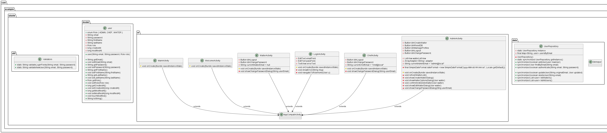

# Groupe-33-repo - Projet uTaste

Ceci est notre fichier README au format Markdown contenant des informations utiles dont : 
- Une description de notre projet
- Des instructions de reconstruction
- Un scénario de validation de notre livrable
- Des limites éventuelles (anomalie, fonctionnalité manquante...)

## Première version de notre modèle conceptuel

Le fichier source PlantUML est disponible dans `doc/diagramV1.puml`.

## Description de notre projet
uTaste est une application Android développée en Java avec Android Studio dans le cadre du cours SEG2505 – Conception et implémentation logicielle à l’Université d’Ottawa. L’objectif est de créer une solution logicielle complète pour la gestion d’un restaurant gastronomique, intégrant des rôles utilisateurs : administrateur, chef cuisinier et serveur.

### Les fonctionnalités principales pour chaque rôles sont
**Administrateur**
- S’authentifier 
- Changer son propre mot de passe 
- Changer son profil (prénom, nom…) ou celui d’un autre utilisateur 
- Créer des utilisateurs avec le rôle « serveur » 
- Réinitialiser la base de données 
- Réinitialiser le mot de passe d’un autre utilisateur 
- Se déconnecter
  
**Chef**
- S’authentifier 
- Changer son propre mot de passe 
- Créer, modifier ou supprimer une recette 
- Ajouter un ingrédient à la recette en :
  - Scannant le QR-code d’un produit disponible en épicerie 
  - Précisant la quantité utilisée (en pourcentage de l’ingrédient choisi) 
- Modifier la quantité d’un ingrédient d’une recette 
- Supprimer un ingrédient d’une recette 
- Obtenir des informations nutritionnelles pertinentes pour chaque ingrédient, telles que celles fournies par OpenFoodFacts, en utilisant l’identifiant obtenu au moyen du code QR 
- Calculer le bilan calorique, en glucides, protides et lipides de la recette 
- Se déconnecter
  
**Serveur**
- S’authentifier 
- Changer son propre mot de passe 
- Voir la liste des recettes et leur bilan calorique 
- Enregistrer une vente avec une note et une appréciation 
- Avoir un bilan des ventes contenant 
  - La liste des recettes vendues et le nombre de vente pour chaque recette 
  - La note moyenne de chaque recette
- Se déconnecter
  
## Limites éventuelle
- Nécessite l'accès à l'internet
- Compatibilité peut être limité parce qu'on utilise Android (API ≥ 30) et pourrait rencontrer des problèmes sur d’autres versions.
- Il y a un seul administrateur et chef qui peut rendre à des limites logistiques

## Scénario de validation

1. Lancer l’application Android Studio sur un émulateur ou appareil physique (API 30+).  
2. Se connecter en tant que :
   - **Admin :** `admin@local` / `admin-pwd`
   - **Chef :** `chef@local` / `chef-pwd`
3. Tester les fonctionnalités accessibles selon le rôle :
   - Admin : création d’un compte « Waiter », option de Edit ou Delete un waiter et changer son propre mot de passe
   - Chef : changer son propre mot de passe
   - Waiter : changer son propre mot de passe
4. Se déconnecter et répéter avec un autre rôle.

## Instructions de reconstruction

1. Ouvrir Android Studio
2. Cloner le dépôt :
   ```bash
   git clone https://github.com/uOttawa-SEG2505/Groupe-33-repo.git
